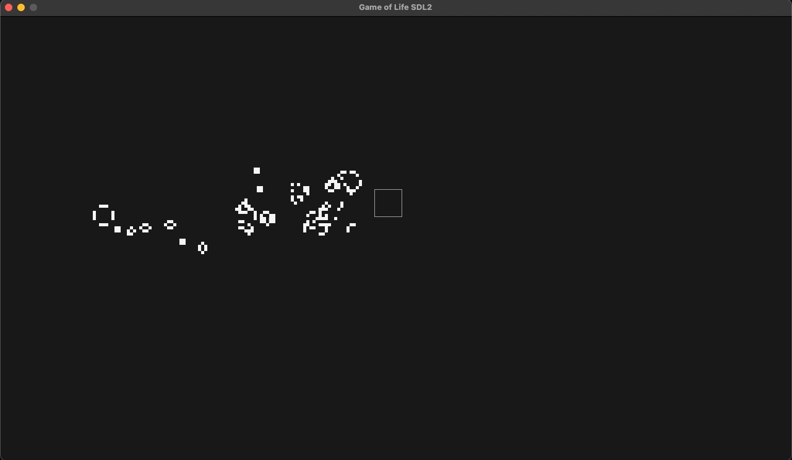

# conway-life-sdl2
An implementation of Conway's Game of Life in C/C++ and SDL2.


Create and destroy cells using LMB and RMB, respectively. Watch the beauty unfold.


Cells record their age. Red cells are volatile and changing; the older stationary cells emerge as green. Hovering the mouse over groups of cells will illuminate them.

## Controls
- `Space`:        pause/play
- `F`:            toggle wireframe
- `C`:            toggle colorization
- `Up arrow`:     slow down
- `Down arrow`:   speed up
- `Left mouse`:   spawn cell
- `Right mouse`:  delete cell
- `Mouse wheel`:  adjust spawn perimeter

## Setup: OS X
### Dependencies
Install SDL2 on your machine via homebrew:
```
brew install sdl2
```

Although not required by this project, see also:
```
sdl2_ttf
sdl2_image
sdl2_mixer
```

### Compiler
Install Xcode (for the clang++ compiler, not the IDE)
```
xcode-select --install
```

Alternatively, just type `gcc` or `g++` in your terminal, and you'll be prompted to install anything that's missing.

### Building
See `Makefile` for details. 
